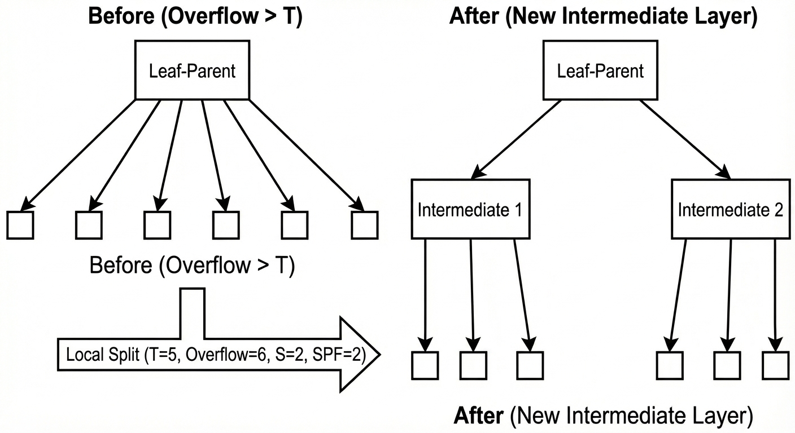

# Bahnasy Tree

Bahnasy Tree is a dynamic tree that represents a **sequence of length $N$** (positions $1..N$). It is controlled by two parameters:

- $T$ (**threshold**): the maximum fanout a node is allowed to have before we consider it “too wide”.
- $S$ (**split factor**): used when splitting; computed from the node size using the smallest prime factor (SPF). If $S > T$, we fallback to $S = 2$.

The tree supports the usual sequence operations (find by index, insert, delete) and can be extended to support range query / range update by storing aggregates (sum, min, etc.) and optionally using lazy propagation.

---

## 1) Node meaning and the main invariant

Each node represents a contiguous block of the sequence. If a node represents a block of length `sz`, then its children partition this block into consecutive sub-blocks whose lengths sum to `sz`.

The key invariant is: **every node always knows the sizes of its children subtrees** (how many leaves are inside each child).

---

## 2) Prefix sizes (routing by index)

Assume a node has children with subtree sizes:

$$
a_1, a_2, \dots, a_k
$$

Define the prefix sums:

$$
p_0 = 0,\quad p_j = \sum_{t=1}^{j} a_t
$$

To route an index $i$ (1-indexed) inside this node:
- Find the smallest $j$ such that $p_j \ge i$.
- Go to that child (and convert $i$ into the child-local index by subtracting $p_{j-1}$).

Because $p_j$ is monotone, this is done using binary search (“lower bound on prefix sums”).

**Figure 1 (routing by prefix sums)**

---

## 3) Building the tree (global split using SPF)

Start with a root node representing $N$ elements.

For a node representing $n$ elements:
- If $n \le T$: stop splitting and create $n$ leaves under it.
- If $n > T$: split it into $S$ children:
  - $S = \mathrm{SPF}(n)$
  - If $S > T$, use $S = 2$
  - Distribute the $n$ elements among those $S$ children (almost evenly), then recurse.

This guarantees that during the initial build, every internal node has at most $T$ children.

---

## 4) Find / traverse complexity (and the simplification)

Define:
- $D$: the depth (number of levels).
- At each level, routing uses binary search on at most $T$ children, so it costs $O(\log_2 T)$.

Therefore:

$$
\mathrm{find} = O(D \cdot \log_2 T)
$$

In a “fully expanded” $T$-ary tree shape, depth is about:

$$
D \approx \log_T N
$$

So a direct expression is:

$$
\mathrm{find} = O(\log_T N \cdot \log_2 T)
$$

Now simplify using change-of-base:

$$
\log_T N = \frac{\log_2 N}{\log_2 T}
$$

Multiplying both sides by $\log_2 T$ gives:

$$
\log_T N \cdot \log_2 T = \log_2 N
$$

So the final form used later is:

$$
\mathrm{find} = O(\log_2 N)
$$

---

## 5) Insert, local overflow, and local split

Insertion happens at leaf level. After inserting a new element, the “leaf-parent” (the node whose children are leaves) increases its number of children.

As long as the leaf-parent still has at most $T$ children, nothing structural is required.

When the leaf-parent exceeds $T$ children, a **local split** is performed:
- A new intermediate layer is created between the leaf-parent and its leaves.
- The old leaves are grouped into $S$ buckets (where $S$ is computed by the same SPF rule capped by $T$).
- This restores a bounded fanout and keeps future routing efficient.

**Figure 2 (local split)**

### Complexity of one local split

A local split creates about $\mathrm{SPF}(T+1)$ intermediate nodes and reconnects about $T+1$ leaves, so ignoring the SPF term, the time is:

$$
O(T)
$$

### Insert complexity

Insert cost is:
- Routing: $O(\log_2 N)$
- Plus possible local overflow handling: $O(T)$

So the worst-case insert is:

$$
O(\log_2 N + T)
$$

---

## 6) Delete complexity

Deletion also consists of:
- Routing to the target: $O(\log_2 N)$
- Removing it from the leaf-parent’s ordered child list (bounded by the same width idea), so $O(T)$

So the worst-case delete is:

$$
O(\log_2 N + T)
$$

---

## 7) Why rebuild is needed (depth growth under repeated inserts)

Repeated insertions concentrated in the same area can create a “deep path” because local splits keep adding intermediate layers.

Consider the worst case where local splits behave like $S=2$:
- After a local overflow, the leaves are grouped into 2 buckets of size about $T/2$.
- To overflow one bucket again and force another local split deeper, it takes about $T/2$ further insertions in that same region.
- Therefore, each new additional level costs about $T/2$ insertions.

If the current depth is $D$ and the tree is considered valid only while $D \le T$, then the number of insertions needed to reach the invalid depth threshold is approximately:

$$
Y \approx (T - D)\cdot \frac{T}{2}
$$

In the worst case (starting from $D = 0$):

$$
Y \approx \frac{T^2}{2}
$$

When the tree becomes invalid, it is rebuilt.

---

## 8) Rebuild time

A rebuild does:
1) Collect leaves into an array of size $N$.
2) Reconstruct the tree from scratch using the global split rule.

The rebuild time is proportional to the number of nodes created.

Leaf level: $N$ nodes.  
Previous levels shrink geometrically, so the maximum total node count is bounded by:

$$
N + \frac{N}{2} + \frac{N}{4} + \frac{N}{8} + \dots
$$

Therefore rebuild cost is:

$$
O(N)
$$

---

## 9) Total cost of rebuilds across $Q$ operations (worst-style bound)

In the worst case, rebuild happens every $\Theta(T^2)$ insertions concentrated in one place.

So number of rebuilds is approximately:

$$
\frac{Q}{T^2}
$$

Each rebuild costs $O(N)$, therefore total rebuild time across all operations is:

$$
O\!\left(\frac{NQ}{T^2}\right)
$$

For operation costs in the same worst-style view, insertion can be treated as $O(T)$ due to local split work, so the operation part is:

$$
O(QT)
$$

Thus a total bound is:

$$
O\!\left(\frac{NQ}{T^2} + QT\right)
$$

---

## 10) Choosing a good $T$

A common practical choice is:

$$
T \approx \sqrt[3]{N}
$$

Because plugging $T = N^{1/3}$ into the rebuild term:

$$
\frac{NQ}{T^2} = \frac{NQ}{N^{2/3}} = QN^{1/3}
$$

and the operations term $QT$ becomes:

$$
QT = QN^{1/3}
$$

so both terms become the same order:

$$
O(Q\sqrt[3]{N})
$$

In practice (based on testing), good values often fall in the range:

$$
T \in [N^{0.27},\, N^{0.39}]
$$

with higher values helping insertion-heavy workloads and lower values helping query-heavy workloads.

---

## 11) Worst-case tests and mitigation

Worst-case behavior happens when a test is engineered to keep inserting in exactly the same place so the tree reaches a depth close to $T$, and then many operations are issued around that hot region.

Common mitigations:
- Randomize $T$ each rebuild within a safe exponent range (e.g. $N^{0.27}$ to $N^{0.39}$).
- Randomize the rebuild target (instead of rebuilding exactly at depth $T$, rebuild at $(0.5/1/2/3/4)\cdot T$).

---

## 12) Implementations

Minimal structure-only implementation (split / split_local / find / insert / delete):  
- [general_structure.cpp](https://github.com/Mostafa-Bahnasy/Bahnasy-Tree/blob/main/src/Bahnasy%20Tree%20src/Generic/general_structure.cpp)

Full implementation (find/query/update/insert/delete + rebuild):  
- [non_generic_version.cpp](https://github.com/Mostafa-Bahnasy/Bahnasy-Tree/blob/main/src/Bahnasy%20Tree%20src/competitive%20programming/non_generic_version.cpp)   